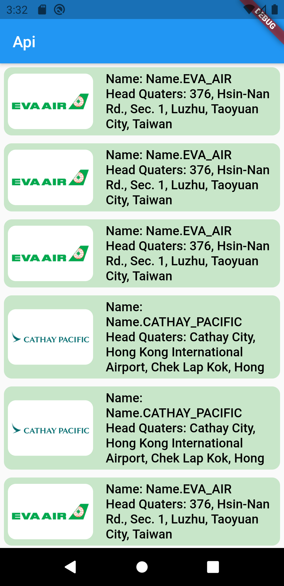

## before clone the GitHub repository please give a star on the repository.

In this video, I am focused on API integration in the flutter project using HTTP for getting responses. and provider for state management. And Pagination for a longer response.

<!-- ### Link to the tutorial: https://youtu.be/qKTEGAUFfFU -->
<!-- ##
### Web Screenshots
 
 
 
  
  -->
##
### Mobile Screenshots

 
 
   
   <!--  -->
 
 